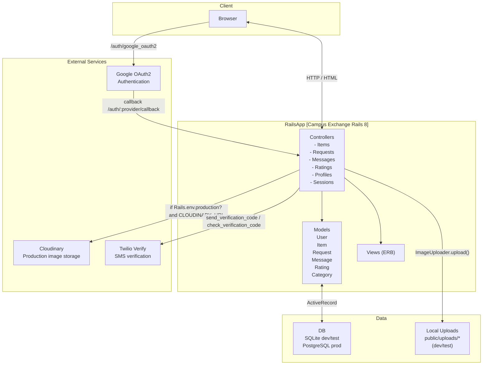

# Architecture Diagram

Notes:
- In development/test, images are saved under `public/uploads/...` and served directly by Rails.
- In production, images are uploaded to Cloudinary and the secure URL is stored in `items.image_url`.
- Twilio credentials live in Rails encrypted credentials; Google OAuth client ID/secret live in `.env` for local dev.
